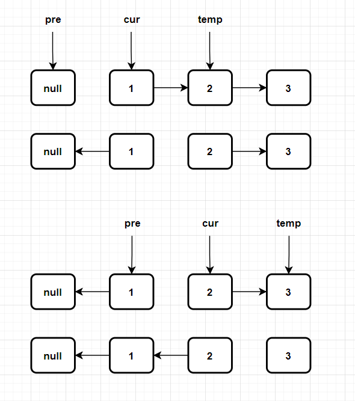

# 206. 反转链表
::: tip 题目来源:
https://leetcode.cn/problems/reverse-linked-list/
:::

给你单链表的头节点 head ，请你反转链表，并返回反转后的链表。

  
> 输入：head = [1,2,3,4,5]  
输出：[5,4,3,2,1]

## 迭代法

```java
class Solution {
    public ListNode reverseList(ListNode head) {
        ListNode pre =null;
        ListNode cur= head;

        while(cur!=null){
            ListNode temp=cur.next;
            cur.next=pre;
            pre=cur;
            cur=temp;
        }
        return pre;
    }
}
```


## 递归法

```java
class Solution {
    public ListNode reverseList(ListNode head) {
        while(head==null || head.next==null){
            return head;
        }

        ListNode res=reverseList(head.next);
        head.next.next=head;
        head.next=null;
        return res;
    }
}
```


## 评价
题不难，面试一般两种方法全部写出来，出题频率很高。
