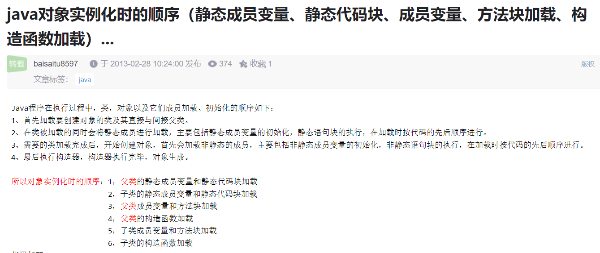
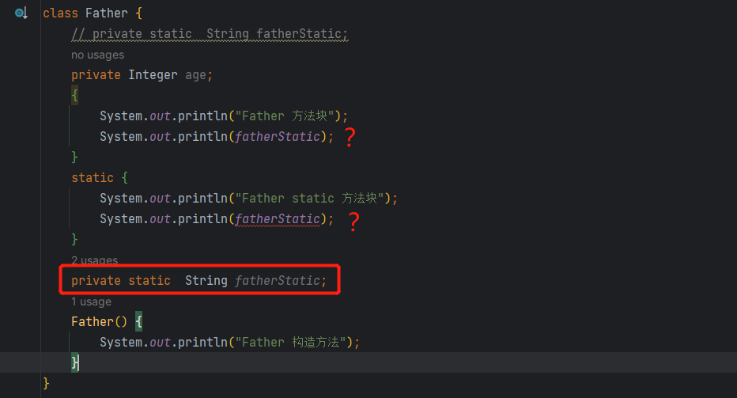
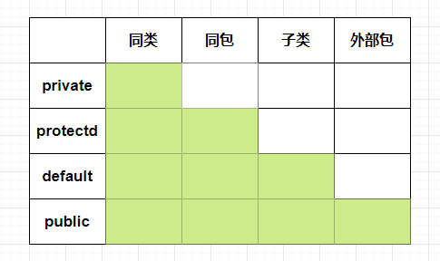
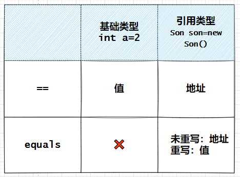
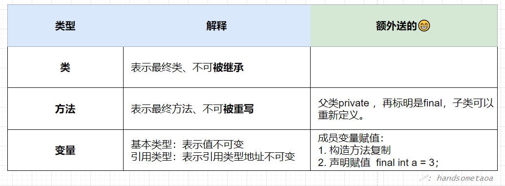
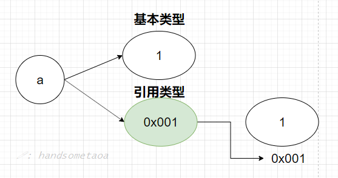
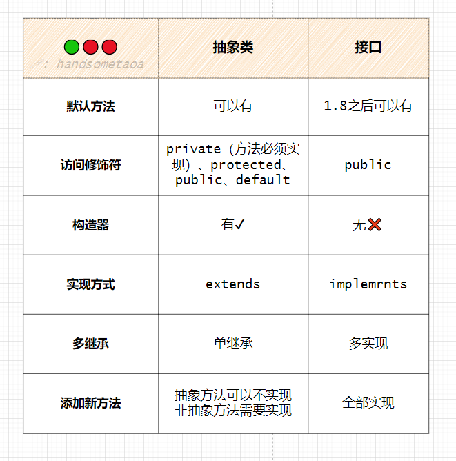
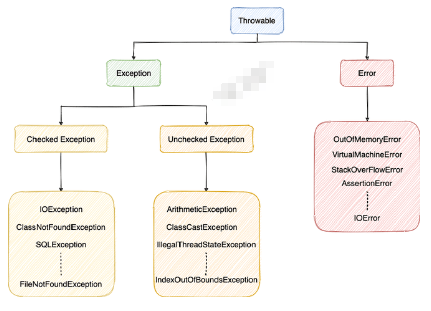
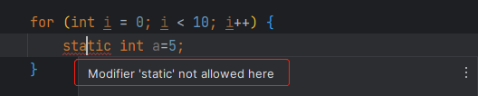

# JAVA基础

## 1.面向对象三大特征
* 封装 ：
  1. 属性与方法：属性描述同一类事务的特征、方法描述同一类事务的操作。封装就是将同一类事务的属性、方法归结到同一个类里面。
  2. 将数据、操作封装起来，尽可能隐藏细节且不允许外部对象直接访问对象的内部信息，设计者提供系列比如Set、Get等授权方法来操作属性，有利于保护数据与解耦。
* 继承 ：就是将子类继承父类非private成员、方法,应该遵循里氏替换原则
  1. 继承就是子类继承父类的特征和行为，使得子类对象（实例）具有父类的属性和方法，或子类从父类继承方法，使得子类具有父类相同的行为。通过使用继承，可以快速地创建新的类，可以提高代码的重用，程序的可维护性，节省大量创建新类的时间 
  2. 对拓展开放,对修改关闭，就是使用继承。
*  多态 : 继承，重写，向上转型
    1. 表示一个对象具有多种的状态，具体表现为父类的引用指向子类的实例。

多态就是指一个引用变量倒底会指向哪个类的实例对象，该引用变量发出的方法调用到底是哪个类中实现的方法，必须在由程序运行期间才能决定。

多态通俗的讲就是父类或接口定义的引用变量可以指向子类或实现类的实例对象，程序在运行时，该引用变量的方法是内存中正在运行的那个方法（子类或实现类里的方法），而不是引用变量的类型中定义的方法。

方法的重写Overriding和重载Overloading是Java多态性的不同表现。重写Overriding是父类与子类之间多态性的一种表现，重载Overloading是一个类中多态性的一种表现。

## 2.long和double在并发环境下的安全问题？
由于long与double都是64字节，而jvm允许一次值读取32字节，所以可能读取到高32字节与低32字节。使用volite可以避免，volite会让变量读取写入都是原子操作。

## 3.加载顺序
## 先静后动，先父后子

如果子类执行有参构造，父类会执行无参构造

## 静态代码块与静态成员变量的执行顺序（谁先谁执行）


## 4.访问控制权限



## 5.父类private方法，子类可以重新定义吗？
可以，父类private方法子类不可以继承，子类可以拥有同名方法。


## 1. java基本数据类型（Java中除了基本数据类型，皆是对象，也就是所谓的一切皆对象）：

  整形：byte、int、short、long
  浮点型：float、double
  字符型：char
  布尔型：boolean

## 2. 包装数据类型：
  注：什么是包装类型？为了像操作对象一下操作基本类型
  整形：Byte、Integer、Short、Long
  浮点型：Float、Double
  字符型：Character
  布尔型：Boolean

## 3.常量池技术：
  整形【-128，127】
  浮点型：小数的话，过于多，常量池技术没有意义
  字符型：【0，127】
  布尔型：true，false

## 4.自动装箱与拆箱：
  基本类型转包装类型：`Integer.valueOf()`
  包装类型转基本类型：`i.intValue()`


## 3. ==和equals的区别
基本数据类型：== 比较的是值，（**equals只能用在于对象，不能用于基本类型**）
引用数据类型：== 比较的是地址，（未重写equals，比较的是地址；重写了equals，比较的是对象的属性）



## 4. 重写equals为什么要重写hashcode
需要保证equals判断相同的对象，hashcode值一定要相同。
hashcode 相同，对象不一定相等，比如说俩个对象会产生Hash冲突。
equals 相同，对象一定相同
**为什么要Hashcode与equals结合一起用？**
1. 先计算出Hashcode，进行快速定位
2. 如果对应位置没有元素，就说明一定不存在，如果对应数组位置存在元素，然后要用equals来判断是否真正存在。

## final
final关键字，在Java中可以修饰类、方法、变量


String 底层数组被修饰为final。


## finalize
就是在对象垃圾回收时候回收资源。

## 5.面向对三大特征
 1. 封装
    就是将具体的实现细节、机密代码、繁琐逻辑隐藏起来，给使用者一些接口调用，调用者不必关心细节。
    1.机密代码：不必显示细节
    2.给调用者提供一写接口，供他们使用。

 2. 继承
    在已存在的类的基础上快速创建新类的技术，子类可以继承父类的属性和方法
 3. 多态
    将父类的引用指向子类的实例，表明对象具有多种形态
    多态就是指程序中定义的引用变量所指向的具体类型和通过该引用变量发出的方法调用在编译时并不确定，而是在程序运行期间才确定，即一个引用变量倒底会指向哪个类的实例对象，该引用变量发出的方法调用到底是哪个类中实现的方法，必须在由程序运行期间才能决定。因为在程序运行时才确定具体的类，这样，不用修改源程序代码，就可以让引用变量绑定到各种不同的类实现上，从而导致该引用调用的具体方法随之改变，即不修改程序代码就可以改变程序运行时所绑定的具体代码，让程序可以选择多个运行状态，这就是多态性。
    指向子类的父类引用由于向上转型了，它只能访问父类中拥有的方法和属性，而对于子类中存在而父类中不存在的方法，该引用是不能使用的，尽管是重载该方法。若子类重写了父类中的某些方法，在调用该些方法的时候，必定是使用子类中定义的这些方法（动态连接、动态调用）

允许子类添加更多的功能，而不用修改父类，父类的引用不用修改，对于不同的子类，在执行期间调用不同的方法。


## 6.接口与抽象类



相同点：1. 接口与抽象类都不可以实例化
       2. 接口和抽象类都可拥有抽象方法
       3. 都可拥有默认实现（接口使用default关键字）
不同点：1. 接口的访问修饰符只能是public static ，抽象类的访问修饰符和普通类一样
       2. 接口不能有构造器，抽象类可以有构造器
       3. 关键字不同 interface ，abstract class
       4. 抽象类成员可以被更改，而接口中变量是public static final还必须要初始化。
       5. 抽象类只能单继承，接口可以多实现
抽象类：更注重对子类共同属性的抽象，比如黑种人、黄种人、白种人 可以抽象出一个人的抽象类，具体实现由子类实例化。
上层代码定义规范，下层代码实现逻辑
接口：更注重对行为的一种规范，比如小王会跳舞，但是小刘不会，那我们可以给小王实现一个跳舞接口。

```java
abstract class Father {

    void show() {
        show22();
        show33();
    }

    abstract void show33();

    abstract void show22();
}
```

Spring源码中大量应用。

## 7.异常
都是继承自Throwable
Error是程序不可处理的错误，比如说StackOverFlow、OutOfMemory
Exception是异常，又分为检查型异常和非检查型异常（RuntimeException）
1.检查型异常：IOException，编译前要检查，否则编译不通过
2.运行时异常：RuntimeException，运行时才检查，比如数组越界异常




## 8.try-catch-finally
  finally中内容不执行的情况：
  1. 虚拟机异常结束
  2. 线程退出

  try-finally 中return语句执行情况
  1.try中有return，finally中有return 执行finally中return
  2.try中有return，fianlly没return，执行try中return

  try-with-resources
  1.面对必须关闭的资源，实现AutoCloseable或Closeable 就可以使用

## 9.序列化与反序列化
1. 为什么要有序列化，想要将内存中对像保存在磁盘，方便下次直接读取，想要对象在网络传输。

序列化与反序列化：
  序列化：ObjectOutPutStream  writeObject
  反序列化：ObjectInputStream readObject
有些字段不想序列化，比如密码。
1.static 表明时类的属性，对象序列化就不会序列化
2.transient 表明属性不能序列化

现在想一个问题，对于七层数据模型与5层数据模型，序列化协议应该放在哪里？
七层协议：物理层、数据链路层、网络层、传输层、会话层、表示层、应用层
五层协议：物理层、数据链路层、网络层、传输层、应用层

序列化协议应该在表示层，但是5层协议没有表示层，应该放在应用层。


## 10.为什么Java中只有值传递？
java中只有值传递
对与基本数据类型传递的是值，对于引用类型传递的是地址。

基本数据类型，形参会拷贝一份数据，在方法内操作数据，不影响原来的数据
对于引用数据类型
  1. 对于数组 传递数组的地址，arr[0]=1
  2. 对于String字符串

    String a="abc";
    a="def"
    它是将a的地址值换位def字符串对象的地址值
    原来的abc没有任何改变，如果没有人引用它，可以被垃圾回收器回收
## 11.不可变对象最大的好处
线程安全

## 12.label跳出指定循环
```java
        for (int i = 0; i < 10; i++) {
            aaaa:
            for (int j = 0; j < 20; j++) {
                if (i == 5) {
                    break aaaa;
                }
                System.out.println(i + " " + j);
            }
        }
```
## 13.throws与throw
throw 在方法里抛出具体异常，
throws 在方法头抛出一哥或多个异常，异常信息交给上层处理。

## 14.反转字符串
```
public static String reverseBuffer(String str) {
	return new StringBuffer(str).reverse().toString();
}

public static String reverseBuilder(String str) {
	return new StringBuilder(str).reverse().toString();
}
```

## 15.static 不能修饰局部变量


## 16.String有length() 数组有length属性

## 17.String.trim()删除前后空格
```java
        String str = "    123    ";
        String trim = str.trim();
        System.out.println(str);  //"    123    "
        System.out.println(trim); //"123"
```
## 18.构造器是否可以被重写？
类名都不同，构造器怎么重写。

