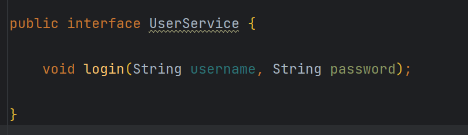

# 全局统一异常处理

RestControllerAdvice是一个与切面有关的注解，每个切面注解都有自己的作用范围，这个的作用范围是单个项目里面所有使用了RequestMapping（getMapping、postMapping）的方法。

## 为什么进行全局异常处理？
日常开发中，为了不抛出异常堆栈信息给前端页面，每次编写的controller都要尽可能catch住所有service的异常，代码耦合性高，不利于维护。【重要】

所以利用RestControllerAdvice+ExceptionHandler进行全局异常处理，一旦项目中发生了异常，就会进入使用了RestControllerHandler注解中ExceptionHandler注解的方法，我们可以将异常信息输出到指定的位置，并对所有错误信息进行归置。

## 实现
```java
@RestControllerAdvice(basePackages ="com.tao.controller"})
@Slf4j
public class GlobalExceptionHandler {

    @ExceptionHandler(NullPointerException.class)
    public ApiResult<String> nullPointerException(NullPointerException exception) {
        log.error("空指针异常", exception);
        return ApiResult.error("程序内部空指针异常，请联系程序员！");
    }

}
```
当controller 中方法（一定是加了@RequestMapping注解的）抛出空指针异常后，会直接进入此方法进行处理。

## 测试实例
### 项目结构

#### LoginException

#### GlobalExceptionHandler

#### UserController

#### UserService

#### UserServiceImpl


#### 结果
