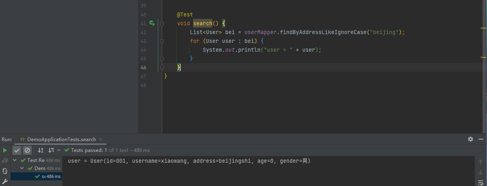

# Spring 集成 ES

## 1. 首先创建一个SpringBoot项目


点击Next


点击Finsh，完成项目创建。


## 2. 修改Yaml 配置文件


## 3.创建User类与UserMapper接口

1. 创建User类

```java
@Data
@Document(indexName = "user-demo")  //指明类所对应的索引
public class User {
    
    @Id //注意一定要，标明ID
    private String id;
    private String username;
    private String address;
    private Integer age;
    private String gender;
}

```


2. 创建UserMapper接口：

```java
public interface UserMapper extends ElasticsearchRepository<User, String> {

}
```


## 4.进行测试

1. 增

   

2. 删

   

   

   

3. 改

   这里注意，ES没有修改，而是直接将数据覆盖，所以我们使用save进行保存。

4. 查

   ```java
   public interface UserMapper extends ElasticsearchRepository<User, String> {
   
       List<User> findByUsername(String username);
   
       List<User> findByGender(String gender);
   
       List<User> findByAddressLikeIgnoreCase(String addressLikeIgnoreCase);
   }
   
   ```

   
   

