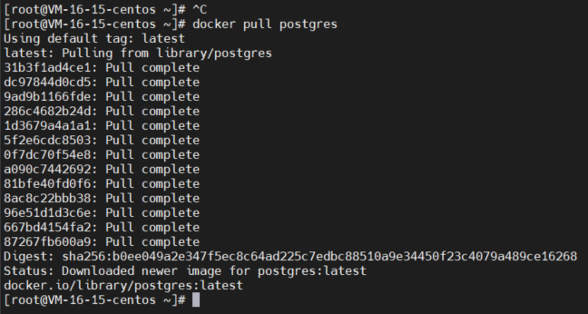
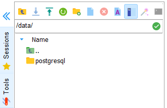
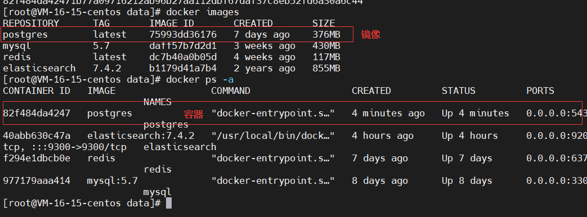
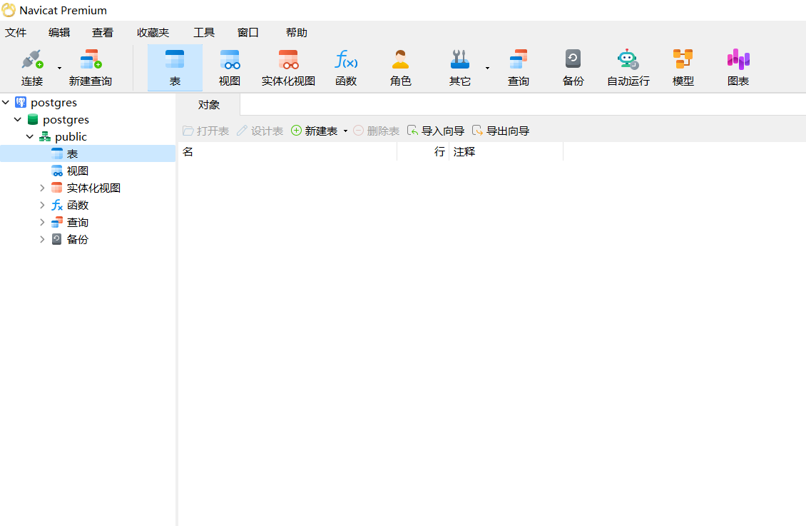

# Docker安装postgre教程

## 1. 拉取镜像
```bash 
docker pull postgres
```

## 2. 创建挂载文件夹
```bash
cd /data
mkdir postgresql
```

## 3. 启动镜像
```bash
docker run --name postgres \
    --restart=always \
    -e POSTGRES_PASSWORD="你的密码" \
    -p 5432:5432 \
    -v /data/postgresql:/var/lib/postgresql/data \
    -d postgres
```


## 4. 测试
```bash
数据库：postgres
用户名：postgres
密码：你的密码
```

