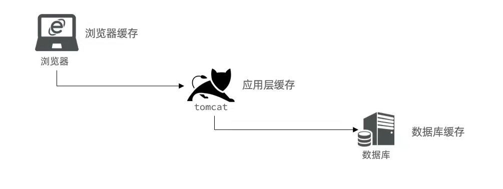
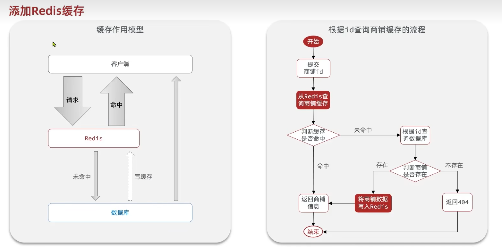

# Redis

SQL的扩展性是垂直，NOSQL的扩展性是水平。

Redis是单线程，6.0以后只是处理网络请求是多线程。

1. 为什么是单线程，但性能却那么好？
   1. 基于内存
   2. I/O多路复用
   3. 良好的编码，C语言

Redis支持持久化，防止断电内存丢失。

Redis支持主从集群、分片集群。

Redis默认有16个库。

## Redis常见命令

Redis是一个key-value数据库，key一般是String，value的类型多种多样。

keys：查看符合模板的所有key，生产环境不建议用Keys，因为是单线程，会阻塞。

del：删除key

exists：判断key是不是存在

expire：设置key过期时间

TTL：查看一个key的剩余有效期 

redis中key允许有多个单词形成的层级结构，多个单词之间用':'隔开，格式如下：

> 项目名：业务名：类型：id
>
> heima:user:1 		{"id":1,"name":"Jack"}
>
> heima:product:1

* String 
  * 根据字符串的不同又可以分为3类
    * String 普通字符串
    * int
    * float
  * String会根据不同格式，形成不同的编码方式，比如用更少字节表示数字。字符串上限不能超过512MB。
  * set、get、mset、mget、incr、incrBy、incrByFloat、setnx、setex
* Hash类型
  * 
* List 类型：
  * 与Java中的双向列表类似。有序、元素可重复，插入、删除速度快。
  * 朋友圈点赞、评论，先后顺序。 
* Set类型：
  * 
* SortedSet类型：底层是跳表+Hash表
  * 可排序、元素不重复、查询速度快
  * SortedSet可排序性，经常被用来实现排行榜这样的功能。

## Redis 客户端

## 缓存

### 1. 什么是缓存

缓存就是数据交换的缓冲区，贮藏数据的零时区域，一般**读写性能**比较高。

浏览器：缓存静态资源，未命中的数据在Tomcat中查找

tomcat：应用层缓存，利用Redis读写性能高的特点。

数据库：比如索引，mybatis多级缓存。

然后再就是访问CPU、磁盘等。

<!--  -->

缓存的作用与缓存的成本

#### 缓存的作用：

1. 减低后端负载，减轻数据库压力
2. 提高读写效率，降低响应时间

#### 缓存的成本：

1. 数据的一致性，缓存与数据库数据不一致
2. 代码维护成本
3. 运维成本，缓存击穿、穿透、雪崩，集群部署，硬件成本。

关于商品的缓存，首先查询缓存，命中直接返回，不命中查询数据库，查询数据库失败则返回失败，查询数据库成功，则添加进缓存，并返回。

<!--  -->

