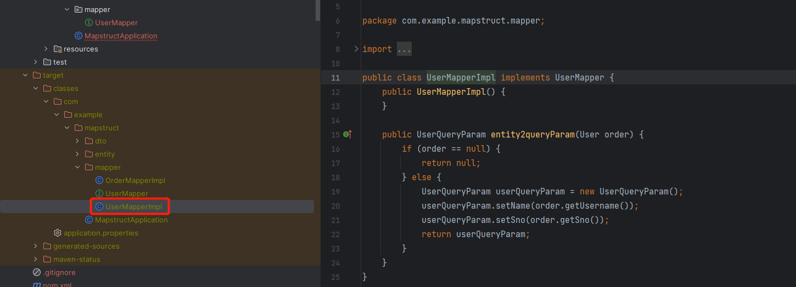

## 介绍（What？Why？How？）
### What?
> MapStruct is a code generator that greatly simplifies the implementation of mappings between Java bean types based on a convention over configuration approach.
> The generated mapping code uses plain method invocations and thus is fast, type-safe and easy to understand.

MapStruct是一个代码生成器，它极大地简化了Javabean类型之间的映射的实现，这是一种基于约定而非配置的方法。生成的映射代码使用简单的方法调用，因此快速、类型安全且易于理解。
### Why?
> Multi-layered applications often require to map between different object models (e.g. entities and DTOs). Writing such mapping code is a tedious and error-prone task. MapStruct aims at simplifying this work by automating it as much as possible.
> In contrast to other mapping frameworks MapStruct generates bean mappings at compile-time which ensures a high performance, allows for fast developer feedback and thorough error checking.

多层应用程序通常需要在不同的对象模型（例如实体和DTO）之间进行映射。编写这样的映射代码是一项乏味且容易出错的任务。MapStruct旨在通过尽可能自动化来简化这项工作。与其他映射框架不同，**MapStruct在编译时生成bean映射**，这确保了高性能，允许快速的开发人员反馈和彻底的错误检查
### How?
> MapStruct is an annotation processor which is plugged into the Java compiler and can be used in command-line builds (Maven, Gradle etc.) as well as from within your preferred IDE.
> MapStruct uses sensible defaults but steps out of your way when it comes to configuring or implementing special behavior.

MapStruct是一个插入Java编译器的注释处理器，可以在命令行构建（Maven、Gradle等）中使用，也可以在您首选的IDE中使用。MapStruct使用合理的默认值，但在配置或实现特殊行为时，它会避开您。

总结，简而言之就是这功能，**Bean copy**：
```
	BeanUtils.copyProperties(userDO,userDTO);
```

## 怎么用
1. 引入依赖
``` xml
        <dependency>
            <groupId>org.mapstruct</groupId>
            <artifactId>mapstruct</artifactId>
            <version>1.4.2.Final</version>
        </dependency>
        <dependency>
            <groupId>org.mapstruct</groupId>
            <artifactId>mapstruct-processor</artifactId>
            <version>1.4.2.Final</version>
        </dependency>
```
2. User与UserQueryParm
```java
@Data
public class User {
    String sno;
    String username;
    String isDelete;
}
```
```java
@Data
public class UserQueryParam {
    String sno;
    String name;
}
```
3. 编写接口
```java
@Mapper
public interface UserMapper {

    UserMapper INSTANCE = Mappers.getMapper(UserMapper.class);

    // User 与 UserQueryParam 字段不一致时映射
    @Mapping(source = "username",target = "name")
    UserQueryParam entity2queryParam(User user);

}
```
4. 使用
```java
public class MapstructApplication {
    public static void main(String[] args) {
        User user = new User();
        user.setSno("20231212");
        user.setUsername("xiaozhang");

        List<UserQueryParam> collect = Arrays.asList(user).stream()
                .map(UserMapper.INSTANCE::entity2queryParam)
                .collect(Collectors.toList());
        for (UserQueryParam userQueryParam : collect) {
            System.out.println(JSONUtil.toJsonStr(userQueryParam));//{"sno":"20231212","name":"xiaozhang"}
        }
    }
}

```
## 答疑解惑
1. 为什么不用BeanUtils.copyProperties(userDO,userDTO)？
当转换的对象是列表时，MapperStruct的优雅才得以展现。

2. MapStruct在编译时生成bean映射？

编译时产生，安全性更高，编译不通过，则会运行失败。

3. 使用mapstruct.Mapper 转换对象属性为null ？
lombok依赖和mapstruct依赖顺序问题，将lombok放前边。
参考链接：https://blog.csdn.net/qq_41169544/article/details/127675917

## 参考
官网：https://mapstruct.org/
ABin-阿斌：https://blog.csdn.net/Mango_Bin/article/details/125168370