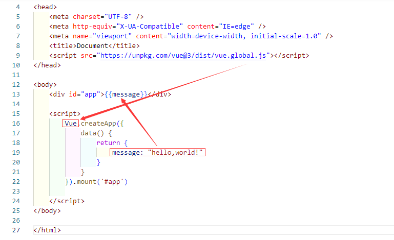
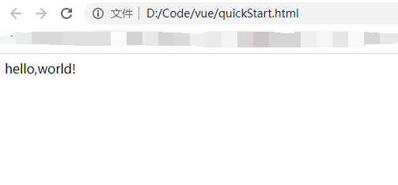

# 快速入门

1. 第一个Vue程序
```vue
<head>
    <meta charset="UTF-8" />
    <meta http-equiv="X-UA-Compatible" content="IE=edge" />
    <meta name="viewport" content="width=device-width, initial-scale=1.0" />
    <title>Document</title>
    <script src="https://unpkg.com/vue@3/dist/vue.global.js"></script>
</head>
<body>
    <div id="app">{{message}}</div>
    
    <script>
        Vue.createApp({
            data() {
                return {
                    message: "hello,world!"
                }
            }
        }).mount('#app')
        
    </script>
</body>

</html>
```

   



2. 内容渲染的方法

   


