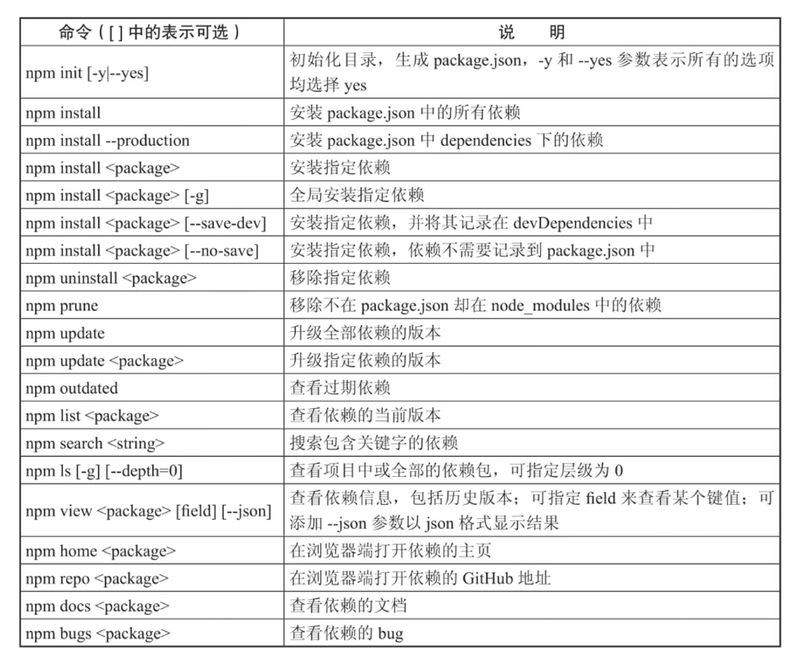

组件化开发

### NPM使用

* NPM是NodeJs包管理和分发工具，类似于Java中的Maven
* NPM最常见的用法就是用于安装依赖与更新依赖，要使用NPM，首先需要安装Node（只是使用其中的NPM工具）

### NodeJs

* Node.js是一个基于Chrom V8 引擎的JavaScript运行时环境

* Node中包含了Npm包管理工具

  

### Vue CLI使用

* Vue CLI是VUE官方提供的构建工具，通常称为脚手架。
* 用于快速搭建一个带有热重载（修改代码后不必刷新页面）及构建生产版本等功能的单页面应用。
* Vue CLI基于 webpack，也可以通过项目内的配置文件进行配置
* 安装 npm install -g @vue/cli

### 脚手架创建Vue项目

```bash
vue create 项目名称
```


 ### 组件化开发

* 组件时Vue最强大的功能之一，组件可以扩展HTML元素，封装可重用的代码。
* Vue的组件系统允许我们使用小型、独立和通常可复用的组件构建大型应用。

