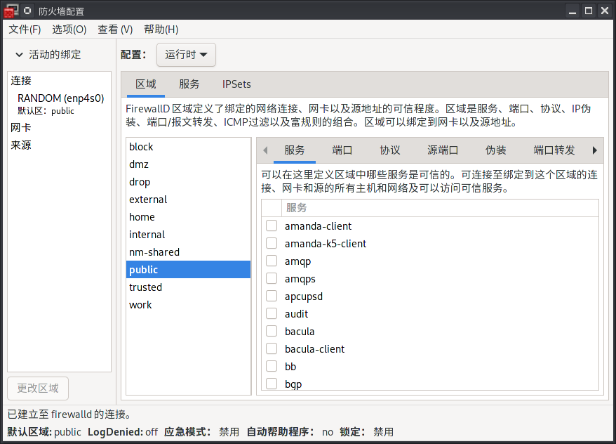

# Arch 神教

> 部分基础内容依旧在 `manjaro` 下，不做迁移。

快入 Arch 神教吧！必读 [WIKI](https://wiki.archlinux.org/)

## 配置输入法

如果有 fcitx 则先卸载：

```sh
sudo pacman -Rsc fcitx
```

接着安装 [fcitx5](https://wiki.archlinux.org/title/Fcitx5_(%E7%AE%80%E4%BD%93%E4%B8%AD%E6%96%87))：

```sh
# fcitx5-im 包组提供 fcitx5 本体、配置工具和必要的输入法模块
# 默认仅支持英文，其他语言则还需要对应的引擎 fcitx5-chinese-addons
sudo pacman -S fcitx5-im fcitx5-chinese-addons 
```

配置环境变量并重新登入：

```sh
# vim ~/.pam_environment
GTK_IM_MODULE DEFAULT=fcitx
QT_IM_MODULE  DEFAULT=fcitx
XMODIFIERS    DEFAULT=\@im=fcitx
SDL_IM_MODULE DEFAULT=fcitx
# vim ~/.xprofile
export QT_IM_MODULE=fcitx5v
```


主题与词库：

```sh
# 皮肤
fcitx5-material-color
# 词库
# 1. 在拼音中启用云拼音并修改后端为 baidu
# 2. 离线词库，安装完成后词典自动启用
sudo pacman -S fcitx5-pinyin-zhwiki # 46.92 MiB
yay -S fcitx5-pinyin-sougou # 183.87 MiB
```

在 `Kernel: 5.18.6-arch1-1`、`DE: Plasma 5.25.1` 版本，输入法的配置在 `系统设置 => 区域设置 => 输入法` 下可进行配置。

## 配置防火墙

使用 `firewall-config` 可视化配置防火墙。

```sh
sudo firewall-config
```



以放行 **`KDE Connect`** 服务为示例：

1. 配置切换到 “永久”
2. 在右下角的 “服务” 中找到 `kdeconnect`，勾选即可
3. 在左上角 “选项” 中重载防火墙

## 在用的小工具

+ 使用 [btop](https://github.com/aristocratos/btop) 替代 top
